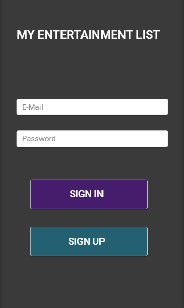
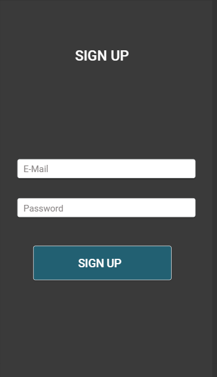
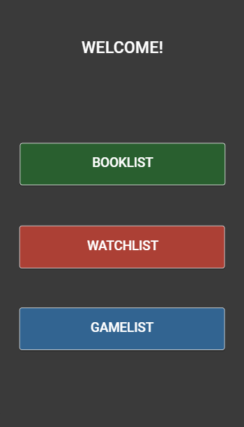
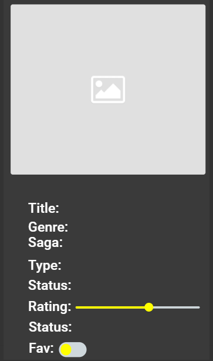

# MyEntertainmentList

## INTRODUCCIÓN

MyEntertainmentList es una aplicación creada en Android nativo que permitirá al usuario almacenar información sobre aquellos libros, videojuegos o series que tiene pendiente o aquellos que ya haya completado y quiera ponerles una nota personal o añadirla a sus favoritos.

## ANTEPROYECTO

### LANDING PAGE/REGISTER PAGE

La aplicación se inicia con una ventana de login para que el usuario pueda introducir sus datos y acceder a su cuenta. También cuenta con un botón que permitirá acceder a la ventana de registro.

<table>
  <tr>
    <td>Pantalla inicial (Login)</td>
    <td>Pantalla de registro</td>
  </tr>
  <tr>
    <td>
      
    </td>  
    <td>
      
    </td>
  </tr>
</table>

### SELECTOR DE LISTA

Una vez realizado correctamente el login, será redireccionado a una sencilla ventana donde se seleccionará la lista a la que el usuario desee acceder.

<table>
  <tr>
    <td>Selección de lista
  </tr>
  <tr>
    <td>
      
    </td>
  </tr>
</table>

### LISTAS

Cada lista cuenta con una estructura similar, permitiendo la eliminación y la edición de los elementos por medio de un menu contextual y la incorporación de nuevos elementos por medio de un botón flotante.

<table>
  <tr>
    <td>BookList</td>
    <td>GameList</td>
    <td>WatchList</td>
  </tr>
  <tr>
    <td>
      
    </td>
    <td>
      
    </td>
    <td>
      
    </td>
  </tr>
</table>

 

### EDIT PAGE/ADD PAGE

Ambas ventanas serán iguales, con la diferencia de que la ventana para editar elementos tendrá todos los campos rellenos con la información previamente establecida.

<table>
  <tr>
    <td>Selección de lista
  </tr>
  <tr>
    <td>
      
    </td>
  </tr>
</table>

### VIEW PAGE

Al hacer un toque sencillo sobre cualquier elemento, se abrirá una ventana mostrando la información completa de dicho elemento.

### MENU Y FRAGMENTOS

Desde el menu de aplicación será posible cerrar la sesión y acceder a las instrucciones de uso de la app. Mediante el uso de fragmentos, se podrá acceder a la pantalla de selección de listas y a la lista de favoritos.

