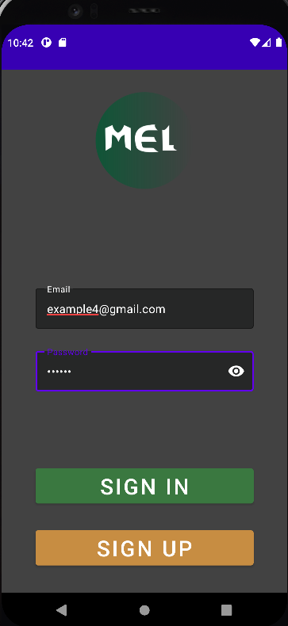
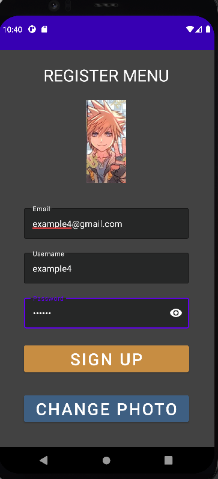
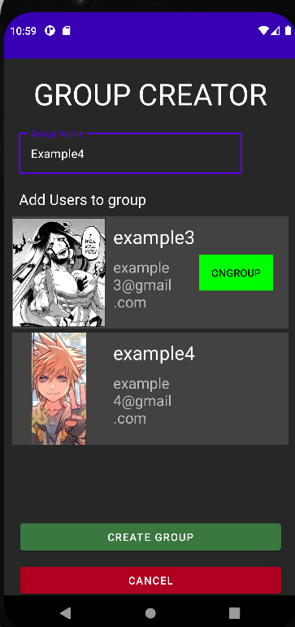
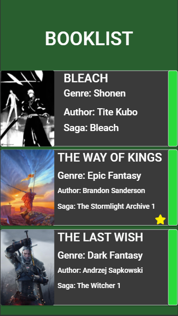
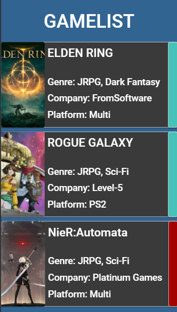
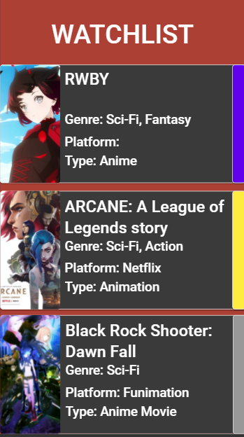
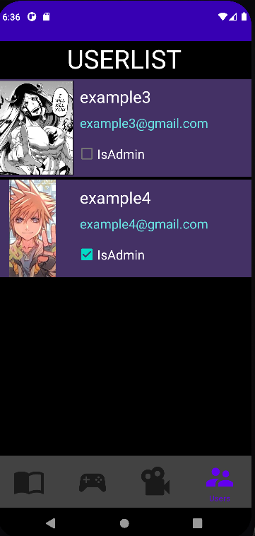

# MyEntertainmentList

## INTRODUCCIÓN/OBJETIVOS DE LA APLICACIÓN

MyEntertainmentList es una aplicación creada en Android nativo que permitirá a un usuario compartir con el resto de usuarios que pertenezcan a su grupo una lista con datos sobre las series, videojuegos o libros que haya completado o este completando (y, en un futuro, permitir a los usuarios no administradores dejar un comentario en cada objeto)

### LOGIN PAGE/REGISTER PAGE

La aplicación se inicia con una ventana de login para que el usuario pueda introducir sus datos y acceder a su cuenta. También cuenta con un botón que permitirá acceder a la ventana de registro.

<table>
  <tr>
    <td>Pantalla inicial (Login)</td>
    <td>Pantalla de registro</td>
  </tr>
  <tr>
    <td>
      
    </td>  
    <td>
      
    </td>
  </tr>
</table>

### HOMEPAGE

Una vez realizado correctamente el login, será redireccionado a una sencilla ventana donde el usuario decidirá crear su propio grupo o, en su defecto, unirse a uno (siempre y cuando un administrador le haya asignado a alguno previamente).

<table>
  <tr>
    <td>Pantalla de selección</td>
    <td>Pantalla de creación de grupo</td>
  </tr>
  <tr>
    <td>
      
    </td>  
    <td>
      
    </td>
  </tr>
</table>

### LISTAS (FRAGMENTOS)

Cada lista cuenta con una estructura similar, permitiendo la eliminación y la edición de los elementos por medio de un menu contextual y la incorporación de nuevos elementos por medio de un botón flotante, además de una cuarta lista donde se podrán visualizar a los usuarios dentro del grupo, asi como si tienen permisos de administrador.

<table>
  <tr>
    <td>BookList</td>
    <td>GameList</td>
    <td>WatchList</td>
    <td>UserList</td>
  </tr>
  <tr>
    <td>
      
    </td>
    <td>
      
    </td>
    <td>
      
    </td>
    <td>
      
    </td>
  </tr>
</table>

